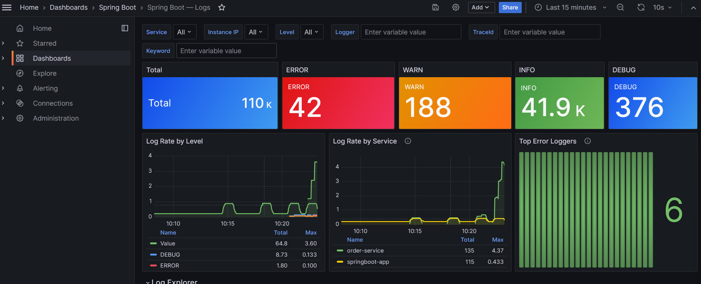

# Spring Boot Monitoring Stack

Monitors a Spring Boot application using **Prometheus** + **Grafana**.

## 專案簡介（中文）

這是一個用來監控 Spring Boot 應用程式的整合範例，透過 **Prometheus** 收集 Actuator / Micrometer 指標，並使用 **Grafana** 顯示儀表板與查詢介面。專案提供 Docker Compose 一鍵啟動的環境，內建 Spring Boot 監控儀表板與日誌查詢畫面，方便快速體驗與擴充。

## Prerequisites

Your Spring Boot app must expose Prometheus metrics. Add to `pom.xml`:

```xml
<!-- Spring Boot Actuator -->
<dependency>
    <groupId>org.springframework.boot</groupId>
    <artifactId>spring-boot-starter-actuator</artifactId>
</dependency>

<!-- Micrometer Prometheus Registry -->
<dependency>
    <groupId>io.micrometer</groupId>
    <artifactId>micrometer-registry-prometheus</artifactId>
</dependency>
```

And in `application.properties` / `application.yml`:

```properties
# Expose actuator endpoints
management.endpoints.web.exposure.include=health,info,prometheus,metrics
management.endpoint.health.show-details=always
management.metrics.export.prometheus.enabled=true
```

## Directory Structure

```
monitor-star/
├── docker-compose.yml
├── prometheus/
│   └── prometheus.yml          # Prometheus scrape config
├── grafana/
│   ├── provisioning/
│   │   ├── datasources/
│   │   │   └── prometheus.yml  # Auto-configure Prometheus datasource
│   │   └── dashboards/
│   │       └── dashboards.yml  # Dashboard provider config
│   └── dashboards/
│       └── springboot.json     # Pre-built Spring Boot dashboard
└── app/                        # (optional) your Spring Boot source
    └── Dockerfile
```

## Usage

### 1. Build & start

```bash
# If using a pre-built image, comment out the `build:` block in docker-compose.yml
# and set image: your-registry/your-app:tag

docker-compose up -d
```

### 2. Access the services

| Service    | URL                        | Credentials       |
|------------|----------------------------|-------------------|
| App        | http://localhost:8080      | —                 |
| Prometheus | http://localhost:9090      | —                 |
| Grafana    | http://localhost:3000      | admin / admin123  |

### 3. View dashboards

Grafana auto-provisions the **"Spring Boot Monitoring"** dashboard under the
**Spring Boot** folder. It includes:

- ✅ App health / uptime
- 📈 HTTP request rate & response times (p99)
- 🧠 JVM heap & non-heap memory
- 🧵 JVM thread counts
- ⚙️ CPU usage

### 4. Stop

```bash
docker-compose down           # stop containers (keep volumes)
docker-compose down -v        # stop + delete volumes (reset data)
```

## Customization

- **Change Grafana password**: set `GF_SECURITY_ADMIN_PASSWORD` in `docker-compose.yml`
- **Add more apps**: add a new `job_name` block in `prometheus/prometheus.yml`
- **Import community dashboards**: download JSON from https://grafana.com/grafana/dashboards
  and place it in `grafana/dashboards/`; popular IDs for Spring Boot: **4701**, **12900**

## Screenshots

### Spring Boot metrics dashboard



### Log explorer (Loki / logs view)


## Author

Maintainer: **MomentaryChen** (`zzser15963@gmail.com`)
