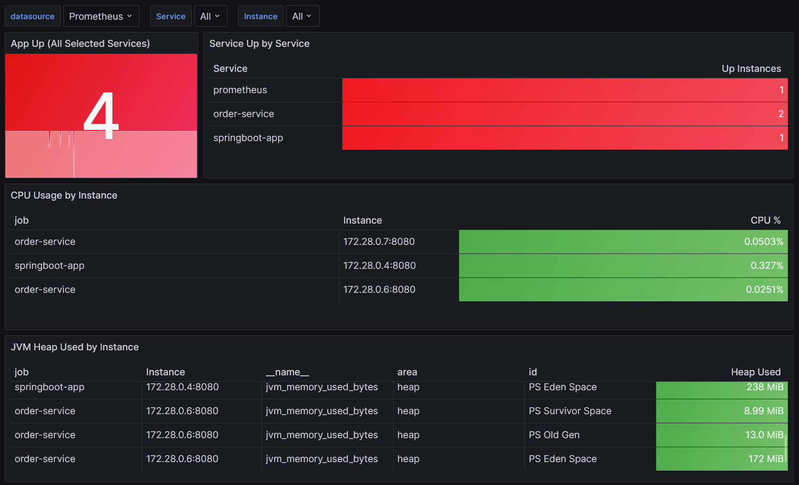
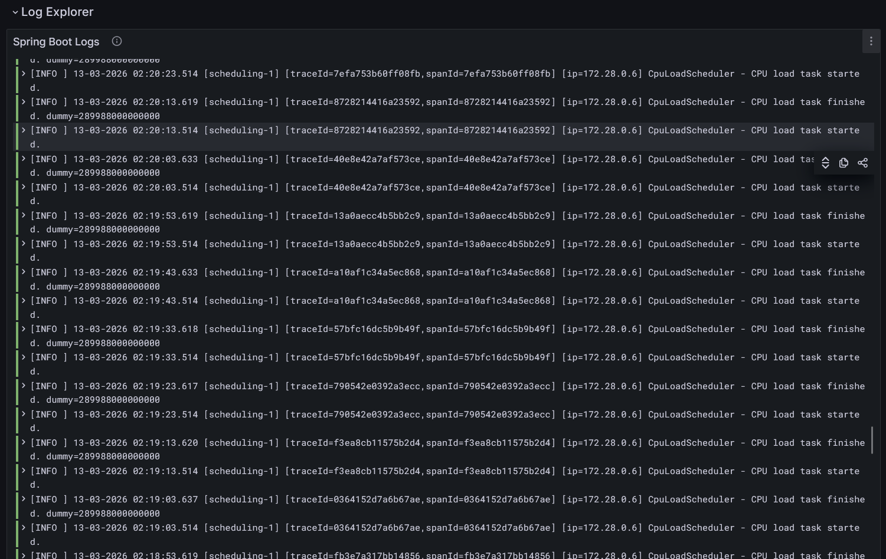
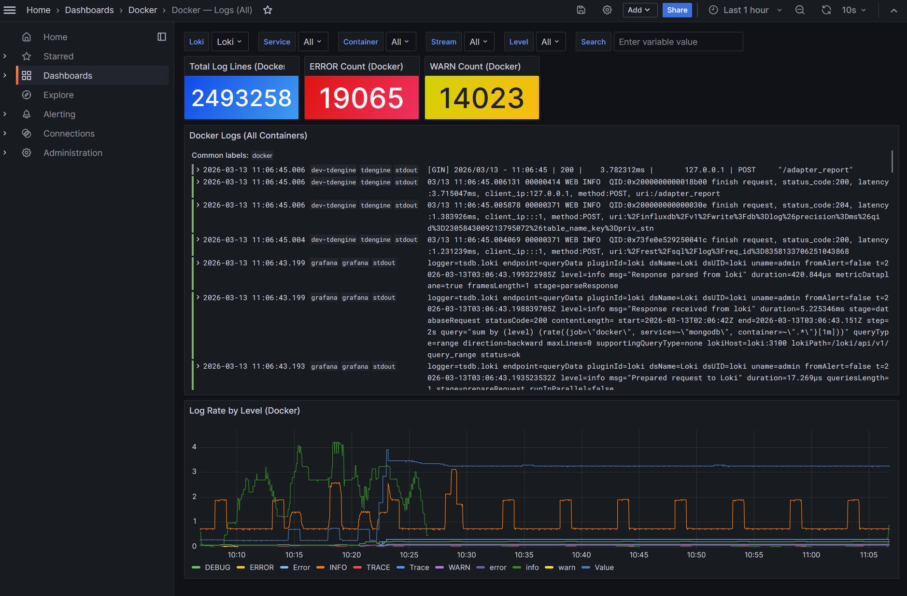

# Spring Boot Monitoring Stack（中文）

這是一個用來監控多個 Spring Boot 應用程式的整合範例，透過 **Prometheus** 收集 Actuator / Micrometer 指標，使用 **Grafana** 顯示指標與日誌儀表板，並搭配 **Loki + Promtail** 做日誌集中化。整套環境透過 Docker Compose 一鍵啟動，內建 Spring Boot 監控儀表板、Spring Boot 日誌儀表板與 Docker 日誌儀表板，方便快速體驗與擴充。

> 🇺🇸 English version: [`README.md`](README.md)

## 先決條件

你的 Spring Boot 應用需要暴露 Prometheus 指標，在 `pom.xml` 中加入：

```xml
<!-- Spring Boot Actuator -->
<dependency>
    <groupId>org.springframework.boot</groupId>
    <artifactId>spring-boot-starter-actuator</artifactId>
</dependency>

<!-- Micrometer Prometheus Registry -->
<dependency>
    <groupId>io.micrometer</groupId>
    <artifactId>micrometer-registry-prometheus</artifactId>
</dependency>
```

在 `application.properties` / `application.yml` 中設定：

```properties
# 開啟 actuator endpoints
management.endpoints.web.exposure.include=health,info,prometheus,metrics
management.endpoint.health.show-details=always
management.metrics.export.prometheus.enabled=true
```

## 專案結構

```text
monitor-star/
├── docker-compose.yml
├── prometheus/
│   └── prometheus.yml          # Prometheus 探測設定
├── grafana/
│   ├── provisioning/
│   │   ├── datasources/
│   │   │   └── prometheus.yml  # 自動設定 Prometheus 資料來源
│   │   └── dashboards/
│   │       └── dashboards.yml  # 儀表板提供者設定
│   └── dashboards/
│       └── springboot.json     # 預先建立的 Spring Boot 儀表板
└── app/                        # （選用）你的 Spring Boot 原始碼
    └── Dockerfile
```

## 使用方式

### 1. 建置與啟動（只用 Docker）

```bash
# 如果使用已建好的映像檔，可以在 docker-compose.yml 中註解掉 build 區塊，
# 並改成 image: your-registry/your-app:tag

docker-compose up -d
```

### 1b. 透過 PowerShell Script (`build.ps1`) 建置

在 Windows / PowerShell 環境下，可以使用專案根目錄提供的 `build.ps1` 來幫忙建置：

```powershell
# 預設：Maven build（跳過測試）＋ docker compose build
.\build.ps1

# Maven build 時執行測試
.\build.ps1 -SkipTests:$false

# 只建置 JAR，不跑 docker compose
.\build.ps1 -NoDockerCompose

# 建置並啟動 docker compose，指定多副本
.\build.ps1 -Up -Replicas 3 -OrderReplicas 2

# 只顯示 README 位置（不進行建置）
.\build.ps1 -Readme
```

### 2. 服務入口

| 服務       | URL                       | 帳號密碼           |
|------------|---------------------------|--------------------|
| App        | http://localhost:8080     | —                  |
| Prometheus | http://localhost:9090     | —                  |
| Grafana    | http://localhost:3000     | admin / admin123   |

### 3. 查看儀表板

Grafana 啟動後會自動匯入 **「Spring Boot Monitoring」** 儀表板，位於
**Spring Boot** 資料夾底下，內容包含：

- ✅ 應用健康狀態 / uptime
- 📈 HTTP 請求頻率與回應時間（p99）
- 🧠 JVM 堆內記憶體與非堆內記憶體
- 🧵 JVM 執行緒數量
- ⚙️ CPU 使用率

### 4. 停止服務

```bash
docker-compose down           # 停止容器（保留資料卷）
docker-compose down -v        # 停止並刪除資料卷（重置資料）
```

## 授權

本專案以 **MIT License** 授權釋出，允許商業與非商業使用、修改與再散佈。  
詳細條款請參考根目錄中的 [`LICENSE`](LICENSE) 檔案。

## 自訂化

- **修改 Grafana 管理者密碼**：在 `docker-compose.yml` 中設定 `GF_SECURITY_ADMIN_PASSWORD`
- **增加更多應用服務**：在 `prometheus/prometheus.yml` 裡新增 `job_name` 區塊
- **匯入社群儀表板**：從 [Grafana Dashboards](https://grafana.com/grafana/dashboards) 下載 JSON
  放到 `grafana/dashboards/`，常見 Spring Boot 儀表板 ID 如：**4701**、**12900**

## 截圖

### Spring Boot 指標儀表板



### Spring Boot 日誌儀表板

`Spring Boot — Logs` 儀表板（位於 `Spring Boot` 資料夾底下）提供：

- **依服務篩選**：可用 Service / Instance IP 變數，過濾到特定 Spring Boot 服務與節點。
- **錯誤與警告總覽**：快速看到當前時間範圍內各等級（ERROR / WARN / INFO / DEBUG）的 log 數量。
- **Top 問題模組**：透過 Top Error Loggers 找出產生最多錯誤的 logger class。
- **Trace / 關鍵字搜尋**：支援 logger 名稱、traceId、任意關鍵字查詢，多服務一起追問題。


### 日誌查詢畫面（Loki / logs view）



### Docker 日誌儀表板

`Docker — Logs` 儀表板（位於 `Docker` 資料夾底下）提供：

- **依容器篩選**：可以鎖定主機上特定 Docker container 的日誌。
- **錯誤與警告總覽**：查看各 container 的 log 量與等級分佈（ERROR / WARN / INFO / DEBUG）。
- **熱門容器**：快速發現產生最多 log 或錯誤的 container，輔助排除基礎設施問題。



## 作者

維護者：**MomentaryChen**（`zzser15963@gmail.com`）

